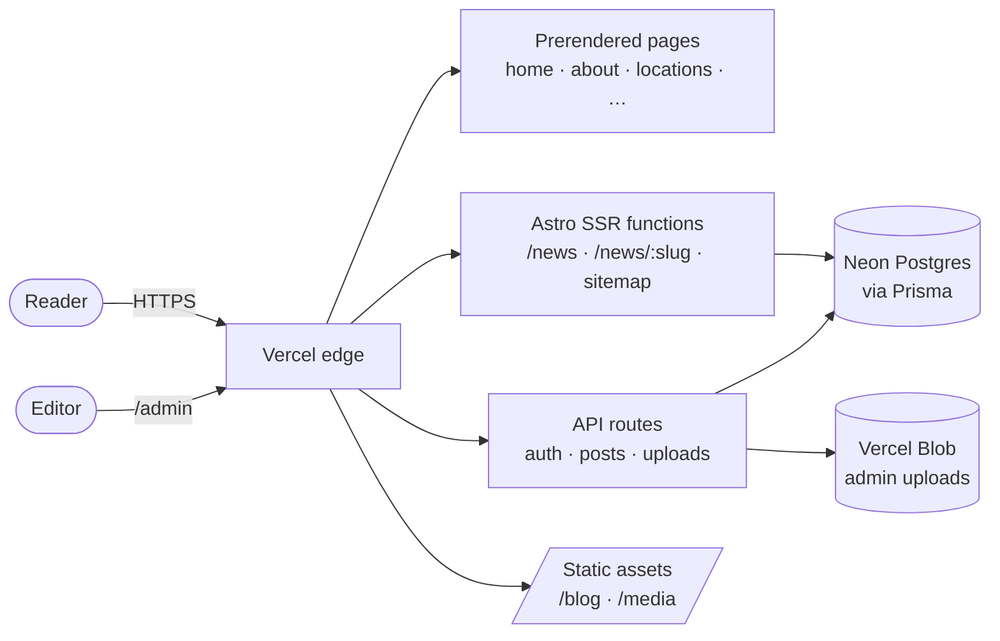

# International Coalition for Human Rights — website

The official website of the **International Coalition for Human Rights (ICHR)**, a Geneva-based
NGO: an institutional site with a trilingual newsroom of press releases, statements and field
updates, managed from a browser-based CMS.

**Live:** <https://www.ichr-international.org> · English, **العربية** (right-to-left) and Français

Engineered and operated by **[Algorythmos](https://github.com/Algorythmos-AI)**.

---

## Highlights

- **Trilingual by construction.** English at the root, Arabic under `/ar` (RTL), French under
  `/fr`. One page body per page, shared by all three locales; a missing translation key is a
  compile error.
- **A newsroom built for sharing and search.** Articles are server-rendered on demand with real
  HTML, per-article Open Graph and Twitter cards, canonical URLs, `hreflang` alternates, escaped
  JSON-LD `NewsArticle` data, and a sitemap grouped by story.
- **Publishing without deploys.** Editors write, preview and publish from `/admin`; articles are
  live the moment they are saved.
- **Light on the wire.** Static marketing pages, responsive image variants for every article
  image, and a click-to-load video facade that makes zero third-party requests until play.
- **Defensive by default.** Sanitized Markdown, escaped structured data, authenticated and
  validated uploads, clamped query parameters, and a database outage that degrades to a
  localized 404 instead of an error page.

## Architecture



| Layer               | Technology                                                                             |
| ------------------- | -------------------------------------------------------------------------------------- |
| Framework           | [Astro 5](https://astro.build) (SSR, `@astrojs/vercel`) · TypeScript · Tailwind CSS v4 |
| Interactive islands | React 19 — admin dashboard, Leaflet world map                                          |
| Data                | PostgreSQL on Neon, via Prisma 5                                                       |
| Content             | Markdown — `marked` + `sanitize-html` on the server, `DOMPurify` in the admin preview  |
| Media               | Vercel Blob for uploads; pre-generated responsive JPEGs for article artwork            |
| Hosting             | Vercel                                                                                 |

## Getting started

**Requirements:** Node.js **22.6+** (production runs Node 24) and a PostgreSQL database — a
free [Neon](https://neon.tech) project works.

```bash
npm install
cp .env.example .env.local                  # fill in DATABASE_URL, DATABASE_URL_UNPOOLED, JWT_SECRET, ADMIN_*
npm run db:push                             # apply the schema — there are no migrations to deploy
node --env-file=.env.local prisma/seed.mjs  # create the admin user (create-only)
npm run dev                                 # http://localhost:4321 — pages and API on one origin
```

Sign in at <http://localhost:4321/admin>. Local image uploads need `BLOB_READ_WRITE_TOKEN`;
seeded articles use static images and work without it.

> **There is no `prisma/migrations/` directory** — `prisma migrate deploy` would silently do
> nothing. If your network blocks Postgres on port 5432, apply schema changes over Neon's HTTPS
> driver instead; see the [engineering handbook](docs/engineering/handbook.md#gotcha-1-the-database-workflow-is-not-what-the-prisma-docs-imply).

## Scripts

| Command                                        | What it does                                            |
| ---------------------------------------------- | ------------------------------------------------------- |
| `npm run dev`                                  | Astro dev server (pages + API)                          |
| `npm run build`                                | `prisma generate` + production build                    |
| `npm run check`                                | `astro check`                                           |
| `npm test`                                     | unit tests (Node's built-in runner)                     |
| `npm run db:push`                              | apply `schema.prisma`                                   |
| `npm run db:seed`                              | create the admin user (create-only, guarded)            |
| `node scripts/gen-press-cover.mjs <statement>` | render branded, overflow-checked cover cards (EN/AR/FR) |
| `node scripts/gen-image-variants.mjs [slug]`   | write responsive image variants and the srcset manifest |
| `node scripts/add-video.mjs <url> [slug]`      | add a YouTube video to `/media`                         |

## Project layout

```
src/
  pages/                  route files — thin wrappers; ar/** and fr/** mirror the English tree
    api/                  auth, content CRUD, uploads, CSP reports
  components/pages/       the page bodies, shared by all three locales
  components/react/       client islands (admin dashboard, world map)
  i18n/                   locale helpers and the en/ar/fr dictionaries
  server/                 server-only code: database, auth, post queries and validation
  lib/                    rendering, SEO, assets, pagination — and their tests
  data/                   version-controlled data (videos, locations)
prisma/
  schema.prisma           User, Post (locale + translationKey), GalleryImage
  lib/press-statement.mjs the publishing engine: validation, atomic upsert, read-back
  seed-*.mjs              one file per published statement — the git record of its content
scripts/                  cover cards, image variants, attachments, videos
public/blog/<slug>/       article artwork and its responsive variants
docs/                     handbook, runbooks, press log
```

## How changes reach production

| Branch        | Role                                                                                                  |
| ------------- | ----------------------------------------------------------------------------------------------------- |
| `integration` | Default branch and trunk. Every change arrives by pull request, squash-merged, after the checks pass. |
| `main`        | Production. Receives `integration` only, through a release pull request merged with a merge commit.   |

Vercel deploys `main` to <https://www.ichr-international.org> and every other branch to a
preview URL. Article _text_ is not deployed at all — it lives in the database and is live as
soon as it is published. See [`CONTRIBUTING.md`](CONTRIBUTING.md).

## Documentation

| Document                                             | For                                                             |
| ---------------------------------------------------- | --------------------------------------------------------------- |
| [Engineering handbook](docs/engineering/handbook.md) | architecture, the database workflow, i18n, security invariants  |
| [Publishing runbook](docs/runbooks/publishing.md)    | publishing a press statement in three languages                 |
| [Release runbook](docs/runbooks/release.md)          | shipping `integration` to production, and what each gate proves |
| [Rollback runbook](docs/runbooks/rollback.md)        | undoing a bad article or a bad release                          |
| [Press log](docs/press-log-2026.md)                  | the record of every published statement                         |
| [Contributing](CONTRIBUTING.md)                      | branches, commits and pull requests                             |

## Security

Please report vulnerabilities privately through GitHub's **Report a vulnerability** button on
the Security tab, not in a public issue.

## License

© The International Coalition for Human Rights (ICHR). All rights reserved.
